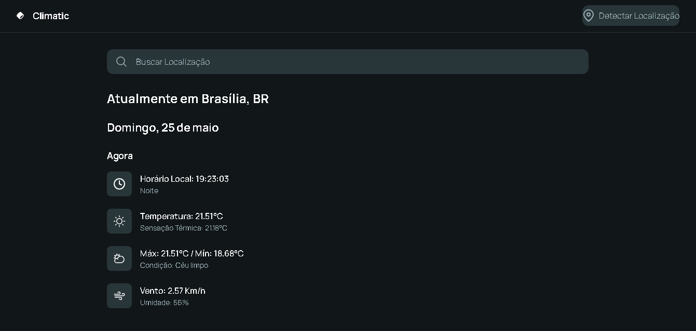

# 🌩️ Climatic

Uma aplicação web moderna feita com **HTML**, **Tailwind CSS**, **JavaScript** e a **API OpenWeather**, ideal para consultar o clima atual de qualquer cidade com estilo refinado e dark mode.

## 🚀 Funcionalidades

- Busca do clima atual por nome da cidade
- Exibição de:
  - Temperatura atual
  - Descrição do clima
  - Umidade e velocidade do vento
- Interface escura, e com animações suaves
## 📸 Preview



🔗 **[Clique aqui para abrir e testar o projeto](https://thalesjuann.github.io/climatic/)**

## 🧠 Tecnologias

- HTML5
- Tailwind CSS
- JavaScript
- OpenWeather API

## ▶️ Como usar

1. Clone o repositório:
```bash
git clone https://github.com/thalesjuann/climatic.git
````

2. Entre no arquivo `script.js` e procure:

```js
const apiKey = "";
```

Substitua pela sua chave pessoal da OpenWeather.

3. Abra o arquivo `index.html` no navegador.


## 📁 Estrutura

```
📦 climatic/
├── index.html
├── src/
│   └── javascript/
│       └── script.js
└── preview.png
```

## 📌 Licença

Este projeto está sob a licença [MIT](LICENSE).

---

Feito por [Thales Juan](https://github.com/thalesjuann) 🚀